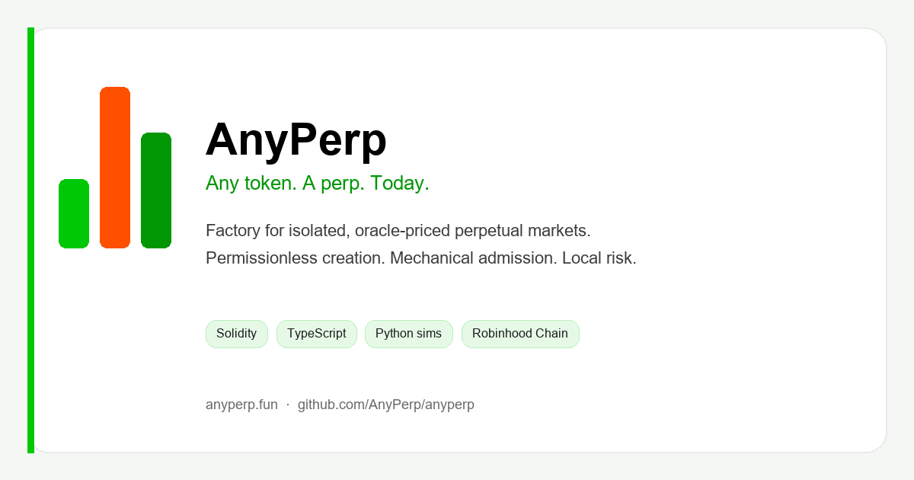

<p align="center">
  
</p>

<p align="center">
  <a href="https://anyperp.fun">Website</a> ·
  <a href="https://anyperp.fun/?surface=app">App</a> ·
  <a href="https://anyperp.fun/?surface=docs">Docs</a> ·
  <a href="https://x.com/tradeanyperp">X</a> ·
  <a href="https://github.com/AnyPerp">Org</a>
</p>

<p align="center">
  
  
  
  
</p>

# AnyPerp

Unaudited testnet prototype for permissionless, isolated perpetual markets on Robinhood Chain.

**Site:** [anyperp.fun](https://anyperp.fun)  
**Tagline:** *Any token. A perp. Today.*

> **Not affiliated with Robinhood.** Do **not** use with real funds. This software is provided as-is under the MIT License with no warranty.

---

## Deployed contracts (Robinhood Chain testnet `46630`)

Public addresses from the live AnyPerp testnet suite. **Unaudited.** Verify bytecode on the explorer before integrating. Source of truth: [`deployments/46630-latest.json`](https://github.com/AnyPerp/anyperp/blob/main/deployments/46630-latest.json).

Explorer base: [explorer.testnet.chain.robinhood.com](https://explorer.testnet.chain.robinhood.com)

### Core protocol

| Contract | Role | Address |
|---|---|---|
| **apUSD** (MockCollateral) | Mintable test USD — margin & LP | [`0x8f3e02f6ae47ec0e5ff5dcd4dd1bfbd3c1fed2f0`](https://explorer.testnet.chain.robinhood.com/address/0x8f3e02f6ae47ec0e5ff5dcd4dd1bfbd3c1fed2f0) |
| **MarketFactory** | Deploys isolated markets | [`0xd1e154498a382074cf66f3274244d55b80b1a52d`](https://explorer.testnet.chain.robinhood.com/address/0xd1e154498a382074cf66f3274244d55b80b1a52d) |
| **MarketRegistry** | Canonical market directory | [`0xbdd1ab0bf5ea2846e05d80771958332f328e6da3`](https://explorer.testnet.chain.robinhood.com/address/0xbdd1ab0bf5ea2846e05d80771958332f328e6da3) |
| **LaunchHelper** | One-tx create (CA → live market) | [`0xaec57bd44a14302c9d157f1ba14c0b664f00209c`](https://explorer.testnet.chain.robinhood.com/address/0xaec57bd44a14302c9d157f1ba14c0b664f00209c) |
| **OracleRouter** | Price routes / adapters | [`0xd9e74c0ebdfbb9538b63fe5d7e4456456ef4a13b`](https://explorer.testnet.chain.robinhood.com/address/0xd9e74c0ebdfbb9538b63fe5d7e4456456ef4a13b) |
| **LiquidationEngine** | Liquidations | [`0x381c70f1eead30094543e544fab0bae3d412f212`](https://explorer.testnet.chain.robinhood.com/address/0x381c70f1eead30094543e544fab0bae3d412f212) |
| **TriggerOrderManager** | Triggers / TP-SL rails | [`0x6ca42a07fb4bf7ff5125a971a188a47670ed4b45`](https://explorer.testnet.chain.robinhood.com/address/0x6ca42a07fb4bf7ff5125a971a188a47670ed4b45) |
| **MarketLens** | Read helpers / views | [`0xbbb2b1585f6b5ea0fe0c2e587a6f8b386eb60c97`](https://explorer.testnet.chain.robinhood.com/address/0xbbb2b1585f6b5ea0fe0c2e587a6f8b386eb60c97) |
| **RiskManager** | Risk params / tiers | [`0x084e967a17b550075674c502de1a845583da3d05`](https://explorer.testnet.chain.robinhood.com/address/0x084e967a17b550075674c502de1a845583da3d05) |
| **ProtocolBackstop** | Capped backstop | [`0xf8c10cb2d201deae44b3849631f7d9e4696e25c5`](https://explorer.testnet.chain.robinhood.com/address/0xf8c10cb2d201deae44b3849631f7d9e4696e25c5) |

### Supporting modules

| Contract | Address |
|---|---|
| **FundingEngine** | [`0x165560af67525ac40f2139060735f1f0113a1403`](https://explorer.testnet.chain.robinhood.com/address/0x165560af67525ac40f2139060735f1f0113a1403) |
| **FeeManager** | [`0x430da704ae8ee82752ff9ed30f6eb0727b456682`](https://explorer.testnet.chain.robinhood.com/address/0x430da704ae8ee82752ff9ed30f6eb0727b456682) |
| **KeeperRegistry** | [`0xb650dc5b5dbc6da3984259ba924e22403039ed89`](https://explorer.testnet.chain.robinhood.com/address/0xb650dc5b5dbc6da3984259ba924e22403039ed89) |
| **EmergencyGuardian** | [`0xaadd1a1ab022389b47f0f945a0fa96c240c75fb1`](https://explorer.testnet.chain.robinhood.com/address/0xaadd1a1ab022389b47f0f945a0fa96c240c75fb1) |
| **MarketImplementation** | [`0x4f7c22822bbeedce686efb38ce3de42be07f7082`](https://explorer.testnet.chain.robinhood.com/address/0x4f7c22822bbeedce686efb38ce3de42be07f7082) |
| **VaultDeployer** | [`0x1cd24183dee6d7edea7cad910316bf7b7f9611b8`](https://explorer.testnet.chain.robinhood.com/address/0x1cd24183dee6d7edea7cad910316bf7b7f9611b8) |
| **MarketDeployer** | [`0x7b7a8beddf416e071b8c13db1c3d8648699d0246`](https://explorer.testnet.chain.robinhood.com/address/0x7b7a8beddf416e071b8c13db1c3d8648699d0246) |

### Roles

| Role | Address |
|---|---|
| **Governance (timelock)** | [`0xaf494c7ad0732d2a2a7b8d47757f4aa2b2908ace`](https://explorer.testnet.chain.robinhood.com/address/0xaf494c7ad0732d2a2a7b8d47757f4aa2b2908ace) |
| **Emergency council** | [`0xffEE7f1305c2D43f6512B33A17fD80e54b5830cD`](https://explorer.testnet.chain.robinhood.com/address/0xffEE7f1305c2D43f6512B33A17fD80e54b5830cD) |
| **Treasury** | [`0x286539fc7431076aA75D11351dEcC5C37C724Ff7`](https://explorer.testnet.chain.robinhood.com/address/0x286539fc7431076aA75D11351dEcC5C37C724Ff7) |
| **Deployer** (ops only) | [`0x3a147ed1980bbD468Bc4FA6102eB264CbC8E2556`](https://explorer.testnet.chain.robinhood.com/address/0x3a147ed1980bbD468Bc4FA6102eB264CbC8E2556) |

### Demo / listed markets

| Market | Address |
|---|---|
| **Demo market (BTC)** | [`0x2D2EE857198874e89Db2Cf29C3E1B47Bfb184cEa`](https://explorer.testnet.chain.robinhood.com/address/0x2D2EE857198874e89Db2Cf29C3E1B47Bfb184cEa) |
| Market ID | `0x0086bac6568bb3c77286c04f30a345f6cebca92a5619ec091faeda64e9079f82` |
| Base token (apBASE) | [`0xf07a6d0b9453941c68dffebf181d556def09a8bf`](https://explorer.testnet.chain.robinhood.com/address/0xf07a6d0b9453941c68dffebf181d556def09a8bf) |
| Liquidity vault | [`0xa6026956fA4c20C7C4A04da076fA0d38dac21407`](https://explorer.testnet.chain.robinhood.com/address/0xa6026956fA4c20C7C4A04da076fA0d38dac21407) |
| Insurance fund | [`0x391dFF40D80de2E3093DBDb3e022F1811F86b687`](https://explorer.testnet.chain.robinhood.com/address/0x391dFF40D80de2E3093DBDb3e022F1811F86b687) |
| Oracle route ID | `0x14deb0349513e213518bd0247addd8e42d964ef2a7e19388719fbcf52ecbed73` |
| **ETH market** | [`0x8792E44B9220a0Fa45Fa0c67D8B58cEB03C8bb57`](https://explorer.testnet.chain.robinhood.com/address/0x8792E44B9220a0Fa45Fa0c67D8B58cEB03C8bb57) |
| **SOL market** | [`0xa7660AE91D532fFAe8F1531623fAe815B889d7a9`](https://explorer.testnet.chain.robinhood.com/address/0xa7660AE91D532fFAe8F1531623fAe815B889d7a9) |
| **RATDOG market** | [`0x0152536235A3Be21481d66BA6CA51Ba26C054A08`](https://explorer.testnet.chain.robinhood.com/address/0x0152536235A3Be21481d66BA6CA51Ba26C054A08) |

Network helpers: [RPC](https://rpc.testnet.chain.robinhood.com) · [Faucet](https://faucet.testnet.chain.robinhood.com/) · chain ID **46630**

## What this repo is

Open-source engineering surface for the AnyPerp testnet stack:

| Path | Contents |
|------|----------|
| `contracts/src` | Solidity factory, isolated markets/vaults, oracle, funding, liquidation, governance, mocks |
| `contracts/test` | Foundry-style / protocol math tests |
| `simulations` | Python decimal reference model and unit tests |
| `database/migrations` | PostgreSQL schema (canonical + projection tables) |
| `services` | Fastify API, reorg-aware indexer, BullMQ keepers |
| `packages/sdk` | Chain helpers, ABIs, fixed-point utilities |
| `app` | Trading / creation / liquidity / portfolio UI |
| `scripts` | Compile, migrate, verify, gated testnet deploy |
| `configs` | `testnet.json` / `mainnet.json` / `anvil.json` network profiles |
| `deployments` | Public testnet address manifests (no secrets) |
| `ops` | Local stack notes and incident runbooks |
| `public` | Static brand assets |
| `tests` | Frontend / render checks |

Internal product docs, marketing plans, admin tooling, host credentials, and media production assets are **not** published in this repository.

## Security status

Compilation and included tests are engineering checks, **not** an audit. Real-funds use is blocked until real oracles, economic safety proofs, independent audits, legal review, and operational readiness.

See [SECURITY.md](./SECURITY.md) for reporting guidance.

## Requirements

- Node.js **22+**
- [pnpm](https://pnpm.io) `11.13.0` (via Corepack)
- Python **3.12+** (simulations)
- Optional: Docker (Postgres/Redis), Foundry

## Quick start

```bash
# 1) Config (never commit real keys)
cp .env.example .env

# 2) Install
corepack enable
corepack pnpm install --frozen-lockfile

# 3) Compile contracts + unit tests
pnpm contracts:compile
pnpm test:unit
python -m pytest simulations/tests

# 4) Local infra
docker compose up -d postgres redis
# apply database/migrations/*.sql (or pnpm db:migrate with DATABASE_URL set)

# 5) Run processes (separate terminals)
pnpm api:dev
pnpm indexer:dev
pnpm keepers:dev
pnpm dev
```

## Environment

| File | Purpose |
|------|---------|
| `.env.example` | Full local/testnet template (empty secrets) |
| `.env.required.example` | Minimum owner-supplied deploy roles |
| `configs/testnet.json` | Chain `46630` profile |
| `configs/mainnet.json` | Placeholder; deploy gates block reckless mainnet |

Required secrets (local only):

- `DEPLOYER_PRIVATE_KEY` - fresh testnet key
- `KEEPER_PRIVATE_KEY` - separate low-balance keeper
- `DATABASE_URL` / `REDIS_URL` - local or your own managed services

Never reuse keys that have been shared in chat or committed anywhere.

## Launch pipeline (testnet → mainnet)

```bash
pnpm launch:check                          # readiness checklist
pnpm launch --env testnet --write-host-env # host env template
pnpm launch --env testnet --deploy         # deploy (needs keys)
pnpm launch --env mainnet --require-gates  # blocked until mainnet gates pass
```

Feature flags (`NEXT_PUBLIC_PUBLIC_FAUCET`, mock oracle, mintable collateral) are **on** for testnet and **must be off** for mainnet.

## Public surfaces

One deployable frontend with three surfaces:

- `anyperp.fun` - public landing
- docs surface - `?surface=docs`
- app surface - `?surface=app`

Set `NEXT_PUBLIC_SITE_URL`, `NEXT_PUBLIC_DOCS_URL`, and `NEXT_PUBLIC_APP_URL` for your host.

## Testnet deployments

Public address manifests live under `deployments/` (for example `46630-latest.json`).  
A successful manifest should pass:

```bash
node scripts/verify-deployment.mjs deployments/46630-latest.json
```

## CI

GitHub Actions workflow (`.github/workflows/ci.yml`) runs install, contract compile, unit tests, Python tests, lint, build, and smoke checks on `main` and pull requests.

## License

[MIT](./LICENSE) - Copyright (c) 2026 AnyPerp contributors.

